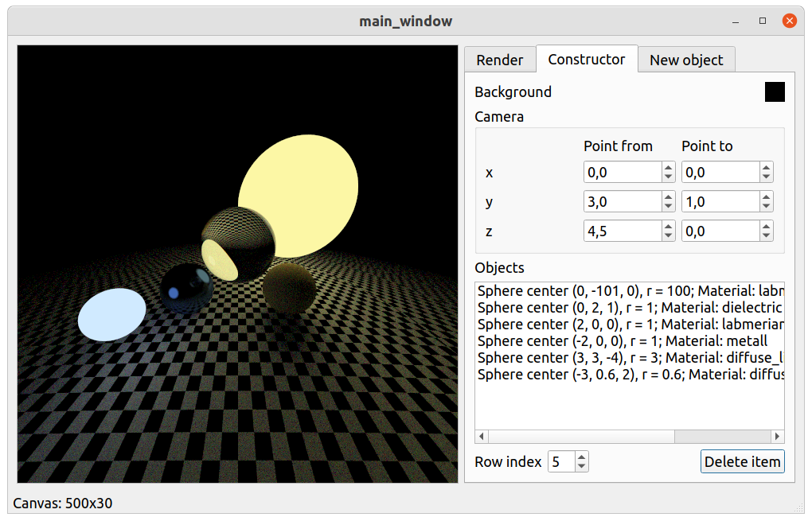
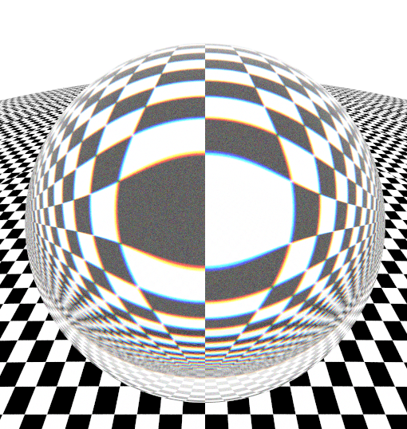

# Курсовая работа по компьютерной графике на тему "Визуализация дисперсии света на прозрачных предметах"





Пример работы с видимой дисперсией

## Зависимости

- gcc
- make, cmake
- qt
- boost (log)
- OpenMP

## Сборка

```bash
cmake -B build
cmake --build build

./build/deniska
```

---

### Полезные ссылки

[latex-стиль по ГОСТу](https://github.com/Orianti/bmstu-latex-class)

[Статья донор с реализацией ray tracing](https://raytracing.github.io/)
